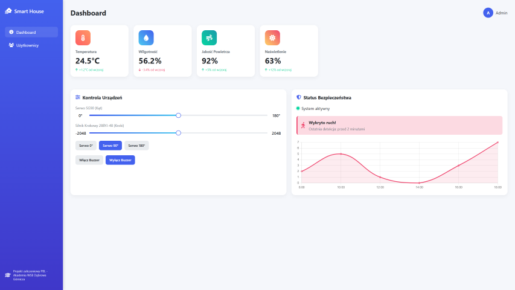

<h1 align="center">Smart Home 🏠</h1>

<p align="center">Aplikacja do zarządzania inteligentnym domem umożliwia zdalne sterowanie urządzeniami domowymi, takimi jak oświetlenie, alarmy czy czujniki </p>

<hr>


<p align="center"><i style="font-style: italic;">Overview</i></p>
<p align="center"></p>

<hr>

### Lista kroków do uruchomienia aplikacji 🧵

1. Sklonuj repozytorium z gałęzi master.
2. Otwórz repozytorium w IDE.
3. Zainstaluj wszystkie biblioteki:

```
python pip install -r requirements.txt
```

4. Zobacz czy w pliku **_serial_reader.py_** poniższa linia kodu zgadza się z twoim portem, jeśli nie to zmień na swoje.

   `ser = serial.Serial('COM3', 9600)  # Replace COM3 with your port`

5. W jednym oknie terminala uruchom komendę, która odpowiada za połączenia z Arduino oraz zapisanie pobieranych danych
   do bazy **_sensors.db_**

```
python read_serial.py
```

6. W drugim oknie terminal uruchom komendę, która odpowiada za uruchomienie strony na localhoscie: http://127.0.0.1:5000

```
python app.py
```

7. Koniec

* Sqlite Database Structure 📃

| id: _int_ | temperature: _int_ | humidity: _float_ | air_quality: _float_ | light_percent: _float_ | lux: _int_ | timestamp: _datetime_ |
|-----------|--------------------|-------------------|----------------------|------------------------|------------|-----------------------|
| 1         | 22.5               | 45                | 89.2                 | 65                     | 300        | 2025-05-04 08:00:00   |
| 2         | 23                 | 46.2              | 87                   | 70                     | 320        | 2025-05-04 08:05:00   |


